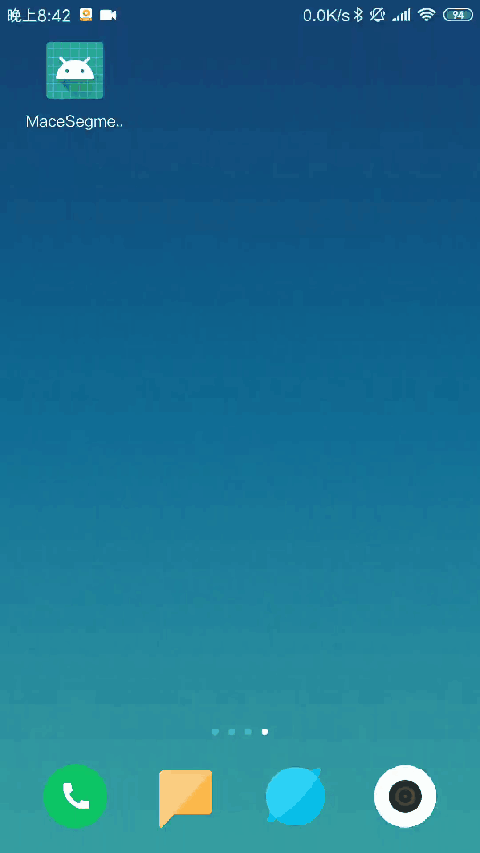

# Android People Segmentation Application with [Mobile Deeplab-v3-plus](https://github.com/nolanliou/mobile-deeplab-v3-plus) powered by [MACE](https://github.com/XiaoMi/mace).

这个项目旨在展示一种能够在尽可能多的Android设备上基于[MACE](https://github.com/XiaoMi/mace)运行神经网络模型的解决方案。

此外，本项目提供了一个通用的MACE JNI的接口供大家参考，该套接口可以扩展支持多种模型。参考[blog](https://zhuanlan.zhihu.com/p/66662510)可以了解完整的过程。

This Application aim to show a solution to run NN models with [MACE](https://github.com/XiaoMi/mace) on
 as many android devices as possible.

The project could extent to multiple kind models(classification, object detection...)
 and every kind model supports multiple different quality models for offering different effects for different devices.
 
# 示例
Prebuilt [APK](http://cnbj1.fds.api.xiaomi.com/mace/demo/people_segmentation_demo.apk).
> **Build with NDK-17b**




# 简介
## 通用性问题
目前来看，现在没有办法做到在所有设备上都运行同一个模型，因为各设备的算力不尽相同。
目前的解决方案一般是根据设备的算力选择合适的模型，依据设备算力选择不同效果的模型，以最大化收益，
比如最新的高通骁龙855机型，你可以使用DSP的模型，一般机型可以使用GPU，或者CPU量化模型。
这个项目就是为了给大家展示一下基于[MACE](https://github.com/XiaoMi/mace)的通用性解决方案。
 
## 解决方案
该解决方案的核心是如何预估模型的运行时间(其实这个很难)。
MACE提供了查询运算设备（CPU，GPU等）算力的[接口](https://github.com/XiaoMi/mace/blob/master/mace/public/mace.h#L137)，
该接口是基于Mobilenet-V2的网络来测试运算设备的算力，以此来预估模型的
运行时间（`这个时间不是完全准确的，只能作为一个参考值`）。
具体代码实现可以参考[ModelSelector](app/src/main/java/com/nolan/macesegmentationdemo/segmentation/ModelSelector.java).

## 模型选择策略
从两个维度出发：设备，模型大小。
1. 设备: DSP->CPU(quantized)->GPU(float)->CPU(float)
2. 模型大小：高->低

# 项目Build流程
1. build
```bash
./gradlew build
```
2. install
```bash
adb install app/build/outputs/apk/release/app-release.apk
```

# 模型构建流程
1. 模型训练
    * 基于[Mobile Deeplab-v3-plus](https://github.com/nolanliou/mobile-deeplab-v3-plus)项目，训练得到模型文件。
2. 定义MACE所需的模型配置文件
    ```yaml
    # model.yml
    library_name: deeplab-v3-plus-mobilenet-v2
    target_abis: [arm64-v8a]
    target_socs: [all]
    model_graph_format: file
    model_data_format: file
    models:
      deeplab_v3_plus_mobilenet_v2:
        platform: tensorflow
        model_file_path: /path/to/model.pb
        model_sha256_checksum: f672f424ac7b4827e13a097060860d0e4a77e5dd2933492be4329635fe1dfab2
        subgraphs:
          - input_tensors:
              - Input
            output_tensors:
              - ResizeBilinear_1
            input_shapes:
              - 1,513,513,3
            output_shapes:
              - 1,513,513,2
        runtime: cpu+gpu
        limit_opencl_kernel_time: 0
        nnlib_graph_mode: 0
        obfuscate: 1
        winograd: 0
    ```
3. 模型转图
    ```bash
    git clone https://github.com/XiaoMi/mace
    cd mace
    git checkout v0.11.0-rc1
    python tools/converter.py convert --config=/path/to/model.yml
    python tools/converter.py run --config=/path/to/model.yml --validate --disable_tuning
    ```
    有两个变量需要提前获取, 可以通过`MACE`的工具获取。
    * [BASE_CPU_EXEC_TIME](app/src/main/java/com/nolan/macesegmentationdemo/segmentation/ModelSelector.java): 测试设备的CPU capability。
    * [ModelInfo.baseCPUExexTime](app/src/main/java/com/nolan/macesegmentationdemo/common/ModelInfo.java): 模型在测试设备上的CPU运行时间。
4. 模型量化
    * 使用MACE的Post Quantization工具对模型进行量化，[文档](https://mace.readthedocs.io/en/latest/user_guide/quantization_usage.html).
    * 上述模型量化后，精度损失在1个点以内。
5. 拷贝模型文件
    ```sh
    # float model
    cp builds/deeplab-v3-plus-mobilenet-v2/model/deeplab_v3_plus_mobilenet_v2.pb app/src/main/assets/deeplab_v3_plus_mobilenet_v2.pb
    cp builds/deeplab-v3-plus-mobilenet-v2/model/deeplab_v3_plus_mobilenet_v2.data app/src/main/assets/deeplab_v3_plus_mobilenet_v2.data
    # quantization model
    cp builds/deeplab-v3-plus-mobilenet-v2/model/deeplab_v3_plus_mobilenet_v2.pb app/src/main/assets/deeplab_v3_plus_mobilenet_v2_quant.pb
    cp builds/deeplab-v3-plus-mobilenet-v2/model/deeplab_v3_plus_mobilenet_v2.data app/src/main/assets/deeplab_v3_plus_mobilenet_v2_qunat.data
    ```


# TODO
- [x] Add quantization model
- [ ] Support multiple models with different input size
- [ ] Add DSP model
- [ ] Support multiple kind models

## License
[Apache License 2.0](LICENSE).

# References
1. **Encoder-Decoder with Atrous Separable Convolution for Semantic Image Segmentation**<br>

    Liang-Chieh Chen, Yukun Zhu, George Papandreou, Florian Schroff, Hartwig Adam. arXiv: 1802.02611.<br>

    [[link]](https://arxiv.org/abs/1802.02611). arXiv: 1802.02611, 2018.
   
2. **MobileNetV2: Inverted Residuals and Linear Bottlenecks**<br />

    Mark Sandler, Andrew Howard, Menglong Zhu, Andrey Zhmoginov, Liang-Chieh Chen<br />
   
    [[link]](https://arxiv.org/abs/1801.04381). In CVPR, 2018.

# Acknowledgement
[JejuNet](https://github.com/tantara/JejuNet)

